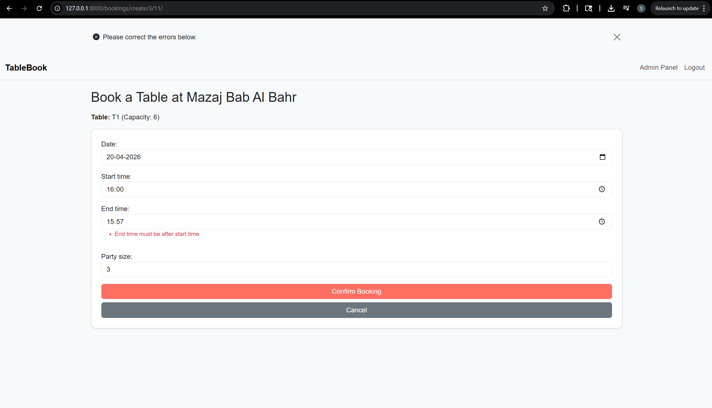

# 🍽️ Restaurant Booking System (Django)

A production-ready full-stack web application for managing restaurant reservations, built using Django, Celery, and Redis. This project demonstrates real-world backend architecture, asynchronous processing, and performance optimization.

---

## 🚀 Key Highlights

- Scalable **multi-app architecture** (accounts, restaurants, bookings)
- Full **booking workflow** with availability checks and validation
- **Asynchronous task processing** using Celery + Redis
- **Caching strategies** (template fragment, low-level, per-view) for improved performance
- Clean and responsive UI using Bootstrap
- Secure **authentication & role-based access control**

---

## 📸 Screenshots

### 🏠 Homepage


### 📅 Booking Page


### 📊 Dashboard


---

## 🧩 Features

### 🔐 Authentication
- User signup, login, logout
- Role-based access control (admin/user)

### 🏪 Restaurant Management
- Create, update, delete restaurants
- Manage tables, menu items, and categories

### 📅 Booking System
- Create / update / cancel bookings
- Real-time availability checks
- Booking confirmation logic

### ⭐ Reviews & Ratings
- Users can rate and review restaurants

---

## ⚙️ Architecture & Design

### 🧠 Core Logic (Booking Flow)
1. User selects restaurant and table  
2. System checks availability  
3. Booking is created  
4. Celery task triggers confirmation email  

---

## ⚡ Performance Optimization

- Template fragment caching for UI components  
- Low-level caching for database-heavy queries  
- Reduced response time and improved scalability  

---

## 🔄 Asynchronous Processing

- **Celery** handles background tasks (email notifications, scheduled jobs)  
- **Redis** used as message broker and caching backend  

---

## 🛠️ Tech Stack

**Backend:**  
- Django, Django ORM, Django Forms  
- Django REST Framework (optional)

**Async & Caching:**  
- Celery  
- Redis  

**Frontend:**  
- HTML5, CSS3, JavaScript, Bootstrap  

**Database:**  
- SQLite (development)  
- PostgreSQL (recommended)

**Tools:**  
- Git, GitHub, VS Code  

---

## 📂 Project Structure
restaurant-booking-system/
│
├── accounts/ # Authentication & user profiles
├── restaurants/ # Restaurants, tables, menus
├── bookings/ # Booking logic & availability
│
├── templates/ # HTML templates
├── static/ # CSS, JS, images
│
├── core/ # Settings, URLs
├── celery.py # Celery configuration
├── requirements.txt


---

## 🔧 Setup Instructions

### 1. Clone the Repository
```bash
git clone https://github.com/shamsusulthan786-max/Restaurant-Tablebook.git
cd restaurant-booking-system
2. Create Virtual Environment
python -m venv env
source env/bin/activate      # Linux/Mac
env\Scripts\activate         # Windows
3. Install Dependencies
pip install -r requirements.txt
4. Run Migrations
python manage.py migrate
5. Run Server
python manage.py runserver
⚙️ Celery & Redis Setup
# Start Redis server
redis-server

# Start Celery worker
celery -A core worker --loglevel=info
🔗 Future Improvements
Payment integration (Stripe)
Docker containerization
Cloud deployment (AWS / DigitalOcean)
JWT authentication for APIs
Real-time notifications (WebSockets)
👨‍💻 Author

Shamsu Sulthan
Python / Django Full-Stack Developer (UAE)

GitHub: https://github.com/shamsusulthan786-max
LinkedIn: https://linkedin.com/in/shamsu-sulthan-369pdfs0s786
⭐ Support

If you found this project useful:

⭐ Star this repository
🍴 Fork it
🧩 Use it in your own projects